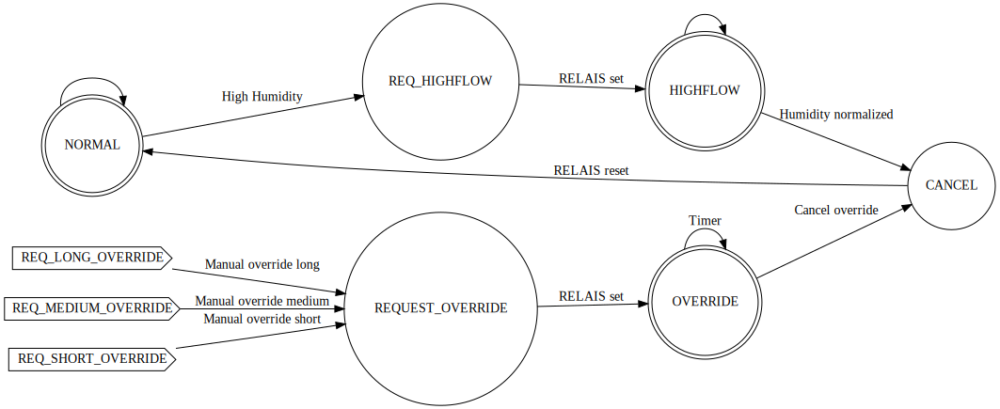

Title
=====
    Climatronic

Details
=======
    Author: Matijs Behrens
    Date  : 29-09-2021
    
    The modbus code is based on Sam Walsh (EmbeddedSam) code from 2014
    https://github.com/EmbeddedSam/Modbus-Slave-for-PSoC4

Summary
=======
    This project is a basis for using ModBUS RTU on a PSoC4

    The project uses a Worker layout
        All recurring routines named by there actual core function
        and executed.
        The workers.c contains all worker functions.
            if the file gets to large, extra files could be added.
            The file name will be Worker_[Function].c|h
             
            All functions are named [return type] [Function name]_worker();
            
        Peripherals:
            The peripherals are extras like:
                - Watchdog
                - Storage / Flash management.
                - startup routines
                
        Sensors:
            The DHT22 is embedded in the design.
            The relevant code/driver is included.

    All global variables and types are stored in the MyTypes.h file.
    
    
Operational:
===========
    
    The PSoC4 has no EEPROM so the Flash memory is used. 
    The Emulated EEPROM component is used. 
    
    This component stores the Modbus Holding register.
    
    All settings are stored in this Holding Register. To aid in the usability 
    a configuration structure is defined. 
    
    This structure is set to a type : interface_t
    This is defined as a pointer which points to the first element of the holding register.
    Now all settings can be set and read remotely through modbus commands. 
    
    Storing the settings can be forced by writing 0x0001 to The second register. 
    normally this value should read 0x0000. if the 0x008X is set this means there is an issue with storing the settings.
    
ADC
---
    The ADC reads 4 channels. 
    All the values are read in 12 bits eg 4096 steps.
    When using an external voltage divider or measurement resistor the slope value can be adjusted. 
    This value is given in uVolts per bit of the ADC. for 5Volt = 5000 mV range: 1221 uV perbit / slope is used. 
    The output then will be in mVolt. 
    
DHT22
-----
    The DHT22 can be hooked up to the uC also. 
    The example code can handle up to 4 DHT22's
    
    Trough the driver / config structure the IO pins can be configured.
    
    The values from the DHT22 are not always accurate. In the RegisterInterface->Datastore.HumidityComp[4] and .TemperatureComp[4]
    (type of int16) a compensation value can be set. to adjust the sensor values. 
    
Storage
-------
    The storage routines are basically a wrapper around the Em_EEPROM component.
    The component can be customized to utilise Flash redundancy and flash wear protection. 
    (see component details) 
    

Automatic
---------
    The automatic mode is activated as a 'part time' worker.
    The task controls:
    
        1) 24 VAC power supply.
        2) Two Airvalves.
        3) Hotwater valve.
        4) High flow setting Heat recovery unit.
        5) Heat request output relais.
    
    The automatic mode can be controlled with the uint16 System.AutomaticOverride register.
        0x8000: The autoheater is on. 
    
## Controle programs
The controle programs are based around Finite State Machines FSM.
The use of FSM's makes it easy to implement multiple control schemas in the same
microcontroller.

### Climate Control program
This program controls the Ventilation. It can ben overriden manually or perform automatic 
increase of ventiolation. The future version will also be able to open and close the bypass
of the Renovent.

In short the ventilation is increased whenever the paramters set in the 'humidityDeviation' register
are met and automatic control is active and no override is given.

    
Warning register
----------------
    8 bit Register containing warning status bits
    
        0x01 DHT22.0 Invalid data
        0x02 DHT22.1 Invalid data
        0x04 DHT22.2 Invalid data
        0x08 DHT22.3 Invalid data
        0x10
        0x20
        0x40
        0x80
    
Error register
--------------
    8 bit Register containing error status bits
    
        0x01 Flash initialization failed
        0x02 Flash reading failed
        0x04 Flash writing failed
        0x08 
        0x10
        0x20
        0x40
        0x800

Software model
==============
    Business employe naming model. 
        the program is ordent in:
            Workers
                A worker function should handle a single task.
                if a task is large or is based on multiple tasks
                the function can be delegated to several assistant functions.
            
            Managers
                A manager function contains only (conditional) calls to worker functions.
                
            Service Worker
                a Worker which acts on an event or request. Can be both partime or fulltime 
                this depends on the type of works which needs to be done.
                
            Worktimes
                A worker / Manager can work full time (continuesly called in the main loop)
                or partime (Timed interval)
            
            
    
ToDo
====
    * UID in register info is not correct
    * Time keeping
    * Store settings / state on powerloss
    * Time based logic
    * Controller program for improved bypass control of the Brink Renovent
    * Controller program for Freekoeling mode in the Brink Elan 10
    * Make the Watchdog timer work properly

Changes
=======
    24102021 ^MB Version 2.08
        Added three modes of ventilation manual override.
             * (20) HighAirflowShort which defaults to 300 seconds of increased airflow
             * (21) HighAirflowMedium default: 3600 seconds
             * (22) HighAirflowLong default: 8 Hours. 
            These values can be altered through the modbus interface. 
        The Warning and Error registers are now cleared at boot. 
		Updates to the documentation

    19102021 ^MB Version 2.07
        Automatic recovery of increased airflow mode in case of sensor issues.
        The returnvalue of the Automated_Humidity_Assistant was wrong. Fixed.

    17102021 ^MB Version 2.06
        Changed Default setting for humitidy control form 10% with 5% hyst. to 6% and 3% hyst. To improve the responsiveness.
        Enhanced the Humidity control program to also support external forced high airflow mode. 
        There where three overrides introduced:
            * Short : for toilet refreshing
            * Medium: General refresh ( cleaning )
            * Long  : Guests mode. 
        Added first steps to RTC support. for future Time based logic.

    12102021 ^MB Version 2.05
        Renamed the project to Climatronic ;-) 
    
    09102021 ^MB Version 2.04
        The Climate (airvalve controls) where interfering with the Humidity control.
        These proceses are now separated and will not interfere with each other. 
        Improved internal code comments.

    05102021 ^MB Version 2.02
        Added Fault en Warning registers
        

    04102021 ^MB Version 2.01
        Added automatic modes
            * Automatic airvent control
            * Automatic Hotwater control
            * Automatic Thermostatic program
        
    29092021 ^MB Version: 2.00
        Refactored the code and added documentation
        fixed some small mistakes in the readme file.
        
    28092021 ^MB Version 1.03
        Dramatically improved Modbus response. by fully interrupt based code.
        
    
    
    
    
